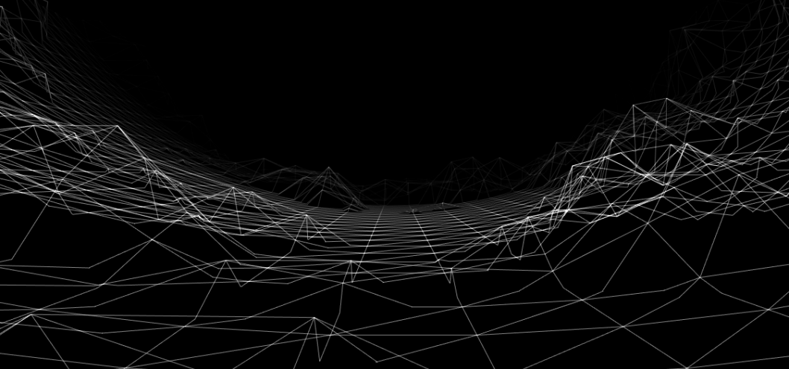
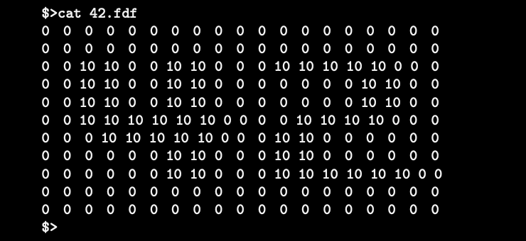

# fdf-42 📐
* [Description](#Description)
* [Usage](#Usage)
* [Compiling](#Compiling)

# Description
The aim of this project is to discover the basics of graphic programming, and in particular how to place points in space, how to join them with segments, and most importantly how
to observe the scene from a particular viewpoint.

In this poject we discover a graphic library: miniLibX. This library was developed internally and includes the minimum necessary to open a window, light a pixel and deal
with events linked to this window: keyboard and mouse. This project introduces to “events” programming.

# Usage 
The coordinates of this landscape are stored in a file passed as a parameter to the program. Here is an example:

  - The horizontal position corresponds to its axis.
  - The vertical position corresponds to its ordinate. 
  - The value corresponds to its altitude.

# Compiling
1. Compile FDF `make`
2. Run `./fdf [map]` 
